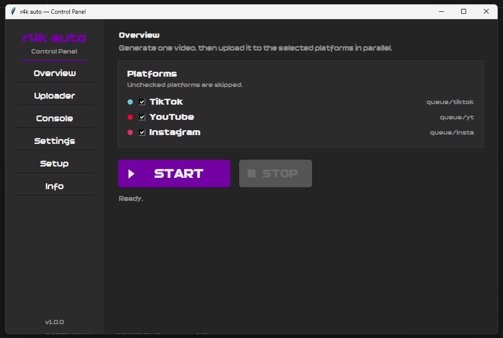
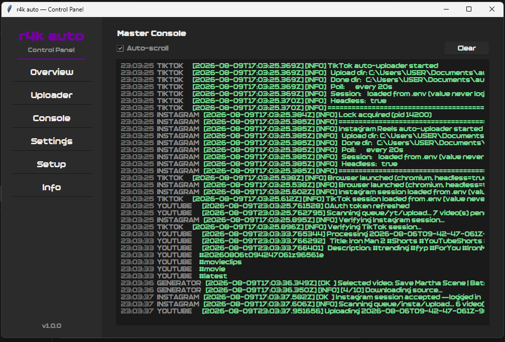

<h1 align="center" id="title">R4K clipping automation v1.0</h1>

##

<p id="description">R4K Auto is an advanced clipping × automation tool designed to transform long-form content into ready-to-post short videos with minimal effort. It automatically selects a random video from a randomly chosen YouTube channel Instagram account or TikTok profile from your provided sources extracts the best moments and converts them into engaging Shorts Reels and TikTok videos with intelligent formatting and automated captions. The tool can enhance every clip by adding background music from your curated Spotify or YouTube playlists while AI-generated titles captions descriptions and hashtags are created specifically for each platform. Once the video is finished R4K Auto completes the workflow by automatically uploading it to YouTube Shorts TikTok and Instagram Reels making the entire process—from content discovery to publishing—fully automated fast and effortless.</p>

<h2>✒️ key features: </h2>
<p> 
🎬 Randomly selects videos from YouTube, Instagram & TikTok.
<br>
✂️ Automatically creates Shorts, Reels & TikToks.
<br>
📱 Formats videos for each platform.
<br>
📝 Generates titles, captions, descriptions & hashtags. <br>
🎵 Adds music from Spotify or YouTube playlists. <br> 
🤖 Automates the entire workflow. <br>
🚀 Automatically uploads to YouTube, Instagram & TikTok. <br> 
⚡ Clip → Edit → Caption → Upload.</p>

<h1 align="center" id="title">📷📸 </h1>




## 🤖 SETUP: 

<h3> 1. Download or clone the repo <br> 2. cd to the tool directory <br> 3. open cmd and run: </h4>

```text
python run.py
```
## 🧧 YouTube Upload Setup: 

YouTube uploads use Google OAuth 2.0. You need to create a **Desktop** OAuth client in the Google Cloud Console and drop its JSON file at the **project root** as `client_secret.json`.

### Step-by-step

1. **Create or pick a Google Cloud project**
   - Go to the [Google Cloud Console](https://console.cloud.google.com/apiprojectcreate) and create a project (or reuse an existing one).

2. **Enable the YouTube Data API v3**
   - Navigate to *APIs & Services → Library*, search for **YouTube Data API v3**, click it, and press **Enable**.

3. **Configure the OAuth consent screen**
   - Go to *APIs & Services → OAuth consent screen*.
   - Choose **External** (or Internal if you're on a Google Workspace account), fill in the app name and your email.
   - Add yourself under *Test users* — the project stays in *Testing* mode, which is fine.
   - Test mode gives the token a limited lifetime (7 days); when it expires, re-run the OAuth setup or set the app to *In production* / add the "publish" status.

4. **Create the OAuth Client ID**
   - Go to *APIs & Services → Credentials → + Create Credentials → OAuth client ID*.
   - Application type: **Desktop app** (this is important — a Web client won't work).
   - Download the resulting JSON and save it as `client_secret.json` in the project main directory.

5. **Authorize once**
   - Run `python -m yt_uploader.setup_oauth` (or launch an upload via the control panel the first time).
   - A browser window opens: sign in with the YouTube account to upload to, review the consent screen, and approve.
   - The access token is saved as `yt_uploader/youtube_token.json` and is refreshed automatically afterward.

> **Note:** The uploader requests the `youtube.upload` and `youtube.force-ssl` scopes, which allow uploading, editing and deleting your own videos — the token is only ever stored locally.
> **Trouble?** If the token expires or the uploader reports a missing/revoked token, delete `yt_uploader/youtube_token.json` and run the OAuth setup again.


## 📐 dashboard:
| Tab       | What it does |
|-----------|--------------|
| **Overview** | The main control tab. Pick which platforms (TikTok, YouTube, Instagram) to include, then hit **START** to run the full workflow: generate one video, then upload it to the selected platforms in parallel. **STOP** cancels everything at any time. A status line shows the current stage and the final result. |
| **Uploader** | Per-platform upload section. Each platform has its own card with an **Upload All** button (uploads every video in that platform's `queue/<platform>/upload` folder), a **Stop** button, a live status line, and a per-platform cooldown **Delay (s)** input — the cooldown between videos on that platform. Each platform runs its own independent worker thread, so uploads never block each other or the UI. |
| **Console** | Master Console — a time-stamped, color-coded (info / warning / error), auto-scrolling log view that streams output from every platform and background task. Includes an **Auto-scroll** toggle and a **Clear** button. |
| **Settings** | Maintenance tools. **Run fix** diagnoses and repairs the project (reinstalls broken dependencies, restores missing files, fixes invalid settings); **Clear cache** deletes logs, temp render files and videos in the done folders (pending uploads and upload history are kept, with a confirmation prompt first). |
| **Setup** | Launches the environment editor (`env_editor.pyw`, single instance) to manage session cookies and generation options such as `VIDEO_CUT`, `VIDEO_LENGTH_SECONDS`, captions, etc. |
| **Info** | About page — project name, version, and contact buttons (Instagram, GitHub, Discord) plus the author handle **ishr4k._**. |
## 🔐 .env value:
| Section | Variable | Type | Description / Default |
|---------|----------|------|-----------------------|
| **AI · OpenRouter** | `OPENROUTER_API_KEY` | secret | Your API key from [openrouter.ai/keys] |
| | `OPENROUTER_MODEL` | text | Model used for scene analysis · `nvidia/nemotron-3-nano-omni-30b-a3b-reasoning:free` |
| | `OPENROUTER_FRAME_MODEL` | text | Fallback frame model · same free Nemotron model |
| **Source Channels** | `AUTO_VIDEO_CHANNELS` | list | Channels to pull videos from — YouTube URLs (`https://www.youtube.com/@Channel`), TikTok IDs (`@user`, `https://www.tiktok.com/@user`) or Instagram usernames (`user`, `https://www.instagram.com/user/`). One per line |
| **Music** | `BACKGROUND_MUSIC_PLAYLISTS` | list | Background music sources — YouTube, YouTube Music or Spotify playlists/URLs |
| | `BACKGROUND_MUSIC_ENABLED` | bool | Background music on/off · `true` |
| | `BACKGROUND_MUSIC_VOLUME` | float | Music volume relative to the video audio, `0.0–1.0` · `0.15` |
| **Caption Image** | `AUTO_VIDEO_CAPTION_IMAGE` | caption | Caption/overlay image shown below the clip (path to a PNG) |
| **Video Cutting** | `VIDEO_CUT` | dropdown | Where clips are cut: `starting`, `anywhere` or `end` · `starting` |
| | `VIDEO_LENGTH_SECONDS` | spinbox | Length of each generated video in seconds · `30` |
| **Platform Sessions** | `TIKTOKSESSIONID` | secret | TikTok session ID for authenticated uploads |
| | `INSTAGRAMSESSIONID` | secret | Instagram session ID for authenticated uploads |
| **Tuning** | `AUTO_VIDEO_MAX_ENTRIES` | int | Max channel catalog entries scanned per run · `2000` |
| | `AUTO_VIDEO_MAX_DOWNLOAD_HEIGHT` | int | Caps the height of downloaded source videos · `1080` |


## ⚙️ Project structure:
```text
r4k/
|-- .env
|-- .env.example
|-- .gitignore
|-- config.js
|-- env_editor.pyw
|-- logger.js
|-- machine.js
|-- package.json
|-- package-lock.json
|-- run.js
|-- run.py
|
|-- autodownload/
|   `-- yt-dlp.exe
|
|-- control_panel/
|   |-- __init__.py
|   |-- app.py
|   |-- config.py
|   |-- first_run.py
|   |-- fonts.py
|   |-- logbus.py
|   |-- main.py
|   |-- repair.py
|   |-- splash.py
|   |-- tabs.py
|   |-- test_app.py
|   |-- widgets.py
|   `-- workers.py
|
|-- instagram_uploader/
|   |-- caption.js
|   |-- config.js
|   |-- errors.js
|   |-- logger.js
|   |-- main.js
|   |-- session.js
|   `-- uploader.js
|
|-- queue/
|   |-- insta/
|   |   |-- done/
|   |   `-- upload/
|   |-- tiktok/
|   |   |-- done/
|   |   `-- upload/
|   `-- yt/
|       |-- done/
|       `-- upload/
|
|-- src/
|   |-- account-manager.js
|   |-- ai-provider.js
|   |-- author.png
|   |-- auto-video-pipeline.js
|   |-- background-music.js
|   |-- config.js
|   |-- fs-utils.js
|   |-- Relidux.otf
|   |-- vertical-renderer.js
|   |-- video-cut.js
|   `-- yt-dlp.js
|
|-- state/
|
|-- tiktok_uploader/
|   |-- config.js
|   |-- errors.js
|   |-- logger.js
|   |-- main.js
|   |-- session.js
|   `-- uploader.js
|
|-- user-assets/
|   `-- caption.png
|
|-- work/
|
`-- yt_uploader/
    |-- __init__.py
    |-- config.py
    |-- hashtags.py
    |-- logger.py
    |-- oauth.py
    |-- requirements.txt
    |-- setup_oauth.py
    |-- upload.py
    |-- uploader.py
    `-- youtube_token.json
```

<h1> 💲Dont try to skid it or sell it. learn and make something of your own💲</h1>
